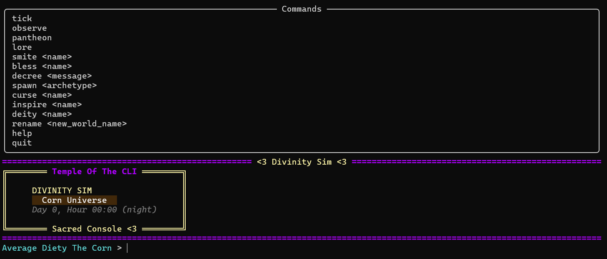
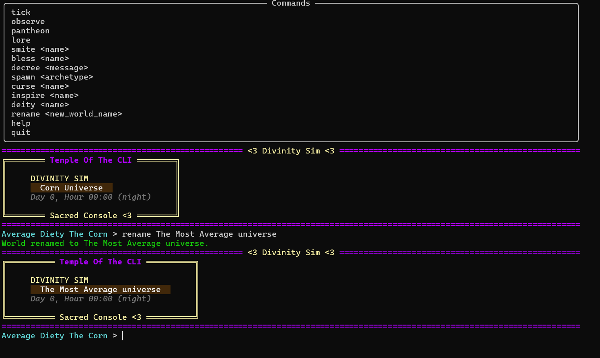
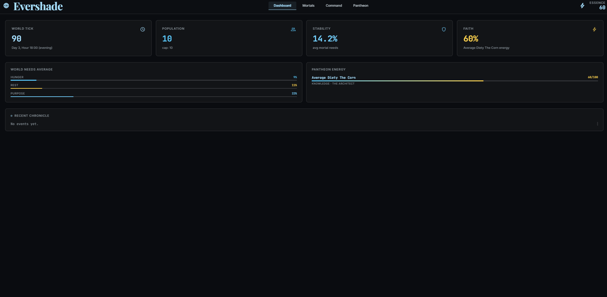
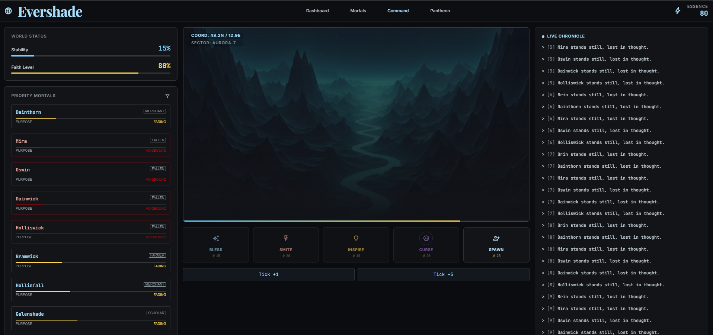

# Divinity Sim

A multi-agent god-game where mortal villagers are LLM-driven agents with persistent memory, needs, and personalities. Developers step in as deities through a browser dashboard or CLI, spending divine energy to bless, smite, inspire, curse, spawn, and decree. The world persists in SQLite and all cognition runs through the Anthropic API — no local models.

## Screenshots

| | |
|---|---|
|  |  |
|  |  |

---

## Requirements

- **Python 3.12+** (3.10+ minimum)
- **Node.js 18+** and npm (for the React dashboard)
- **~500 MB disk** — Python venv + npm packages + SQLite data
- **8 GB RAM** is fine — no local AI models
- An **Anthropic API key** (the sim falls back to placeholder actions without one)

---

## Quick Start (PowerShell)

```powershell
# 1. Clone and enter the project
git clone <repo> divinity-verse-sim
cd divinity-verse-sim

# 2. Set up everything — venv, Python deps, Playwright, npm, .env
.\setup.ps1

# 3. Add your Anthropic API key
notepad .env    # set ANTHROPIC_API_KEY=sk-ant-...

# 4. Start the backend (terminal 1)
.\run.ps1

# 5. Start the frontend dev server (terminal 2)
cd dashboard\frontend
npm run dev
```

Open **http://localhost:5173** in your browser.

---

## Manual Setup

```bash
# Python environment
python -m venv .venv
.venv\Scripts\activate        # Windows
# source .venv/bin/activate   # macOS / Linux
pip install -r requirements.txt
pip install -r requirements-dev.txt   # adds pytest + playwright

# Environment file
cp .env.example .env
# edit .env — set ANTHROPIC_API_KEY

# Frontend
cd dashboard/frontend
npm install
npm run dev       # dev server → http://localhost:5173
```

---

## Running

### Development (two terminals)

| Terminal | Command | URL |
|---|---|---|
| 1 — Backend | `python main.py` or `python start_server.py` | http://localhost:8000 |
| 2 — Frontend | `cd dashboard/frontend && npm run dev` | http://localhost:5173 |

**`main.py`** starts the API server and an interactive CLI in the same process.  
**`start_server.py`** starts the API server only (no CLI prompt) — useful for tests and headless deployments.

The Vite dev server proxies all `/api` requests to the backend on `:8000`, so the frontend always talks to a single origin.

### Production (single port)

```bash
cd dashboard/frontend
npm run build          # compiles React → dashboard/static/
python start_server.py # FastAPI serves the built frontend at http://localhost:8000
```

---

## PowerShell Scripts

| Script | Description |
|---|---|
| `.\setup.ps1` | Create `.venv`, install Python + dev deps, Playwright browsers, npm frontend deps, copy `.env` |
| `.\run.ps1` | Start `main.py` (CLI + API server) |
| `.\build.ps1` | Validate all Python files compile + run TypeScript type-check |
| `.\stop-all.ps1` | Kill backend and Vite/Node processes |
| `.\test.ps1` | Run API tests → start servers → run E2E tests → stop servers |
| `.\test.ps1 -ApiOnly` | API tests only (no browser, no live servers needed) |
| `.\test.ps1 -Headed` | E2E tests with a visible Chrome window |

---

## CLI Commands

Available in the interactive prompt started by `python main.py`:

| Command | Energy cost | Description |
|---|---|---|
| `tick [n]` | — | Advance the simulation by `n` ticks (default 1) |
| `observe` | — | Show all living mortals |
| `pantheon` | — | Show all loaded deities |
| `lore [n]` | — | Show the recent chronicle (default 30 entries) |
| `bless <name> [gift]` | 15 | Boost rest +20 and purpose +30 |
| `inspire <name>` | 10 | Boost purpose +50 with a high-importance memory |
| `decree <message>` | 10 | Broadcast a divine message to the world |
| `smite <name>` | 20 | Kill a mortal instantly |
| `curse <name>` | 20 | Drain all needs by 40 |
| `spawn <archetype>` | 25 | Create a new mortal |
| `deity <name>` | — | Switch the active deity |
| `rename <name>` | — | Rename the world |
| `help` | — | Show command help |
| `quit` | — | Exit cleanly |

---

## How Mortals Work

Each mortal has an **archetype**, three **personality traits**, a **location**, and three **needs** (hunger, rest, purpose — each 0–100, starting at 80). On every tick:

1. The mortal's memory stream is scored by recency + importance; the top 8 memories are injected into the prompt
2. A 1–2 sentence in-character action is generated via the Anthropic API (`claude-haiku-4-5-20251001`, max 150 tokens)
3. Needs decay: hunger −3, rest −2, purpose −1
4. The action is stored as a new memory (importance 3) and broadcast live via SSE

A mortal perishes when any need hits 0.

**Archetypes (8):** farmer · merchant · scholar · guard · wanderer · priest · blacksmith · thief

---

## How Deities Work

Each deity has a **domain**, a **title**, and a pool of **divine energy** (default 100, max 100). Energy restores +5 per tick automatically.

| Action | Energy cost | Effect |
|---|---|---|
| Inspire | 10 | purpose +50 and a high-importance memory |
| Decree | 10 | World-wide divine announcement |
| Bless | 15 | purpose +30, rest +20 |
| Smite | 20 | Mortal dies instantly |
| Curse | 20 | All needs −40 |
| Spawn | 25 | New mortal of chosen archetype added to the world |

**Valid domains:** knowledge · chaos · harvest · war · fate

The population cap is 10 mortals by default — set `SIM_MAX_MORTALS` in `.env` to change it.

---

## Contributing as a Deity

Fork the repo, add a JSON file in `contributors/`, and open a pull request:

```json
{
  "name": "YourName",
  "title": "The Architect",
  "domain": "knowledge",
  "divine_energy": 100,
  "max_energy": 100,
  "color": "white"
}
```

Valid domains: `knowledge` · `chaos` · `harvest` · `war` · `fate`

Files named `example_*.json` or with `"name": "YourNameHere"` are ignored on load.

---

## API Reference

The backend runs on `http://localhost:8000`.

| Method | Path | Description |
|---|---|---|
| `GET` | `/api/world` | World name, era, clock string, tick, stability %, faith %, mortal count |
| `GET` | `/api/mortals` | All living mortals with needs |
| `GET` | `/api/mortals/{name}/memories` | Last 20 memories for a mortal |
| `GET` | `/api/deities` | All deities with name, title, domain, energy |
| `GET` | `/api/lore` | Last 50 world events |
| `GET` | `/api/stream` | SSE stream — live `action` and `tick` events |
| `POST` | `/api/tick` | `{"n": 1}` — advance simulation, returns action list |
| `POST` | `/api/action` | `{"deity": "...", "action": "...", "target": "...", "message": ""}` |

---

## Testing

```bash
# API tests (fast, no browser required)
python -m pytest tests/test_api.py -v

# Layout + interaction E2E tests (requires both servers running)
python -m pytest tests/test_e2e.py -v

# Button-level interaction tests (requires both servers running)
python -m pytest tests/test_buttons.py -v

# Full suite via the orchestrator
.\test.ps1
.\test.ps1 -ApiOnly    # skip browser tests
.\test.ps1 -Headed     # show the browser window
```

The test suite uses **pytest-playwright** pointed at the installed system Chrome — no separate browser download required.

Current coverage: **70 tests** (29 API · 20 E2E layout · 21 button interactions).

---

## Environment Variables

| Variable | Default | Description |
|---|---|---|
| `ANTHROPIC_API_KEY` | _(none)_ | Anthropic API key — required for Claude-powered mortal cognition |
| `SIM_MODEL` | `claude-haiku-4-5-20251001` | Claude model for mortal thoughts |
| `SIM_MAX_MORTALS` | `10` | Population cap |
| `SIM_TICK_DELAY` | `0` | Seconds to sleep between ticks |

---

## Project Structure

```
divinity-verse-sim/
├── main.py                  # CLI entry point + API server (interactive)
├── start_server.py          # API-only server (headless / tests)
├── simulation.py            # Tick loop, divine action dispatcher, runtime
├── requirements.txt         # Runtime Python deps
├── requirements-dev.txt     # Test deps (pytest, playwright, httpx)
├── pytest.ini               # Test config and markers
│
├── world/
│   ├── clock.py             # SimClock — tick → day / hour / time_of_day
│   ├── state.py             # WorldState — SQLite (mortals + world_props tables)
│   └── events.py            # EventBus — SQLite event log + SSE push
│
├── mortals/
│   ├── agent.py             # Mortal class + Anthropic cognition loop
│   ├── memory.py            # MemoryStream — recency + importance scoring
│   └── archetypes.py        # 8 archetype templates
│
├── deities/
│   ├── deity.py             # Deity dataclass + energy system
│   └── pantheon.py          # Pantheon registry (loads contributors/*.json)
│
├── divine/
│   └── actions.py           # smite, bless, decree, spawn, curse, inspire
│
├── api/
│   ├── server.py            # FastAPI app — REST endpoints + static file mount
│   └── sse.py               # asyncio.Queue → text/event-stream
│
├── dashboard/
│   ├── cli.py               # Rich-powered CLI UI helpers
│   ├── frontend/            # React + Vite + TypeScript source
│   │   ├── src/
│   │   │   ├── App.tsx
│   │   │   ├── api.ts            # Typed fetch wrappers for all endpoints
│   │   │   ├── useSimulation.ts  # State hook + SSE subscription
│   │   │   └── components/
│   │   │       ├── Header.tsx        # Fixed top bar (world name + essence)
│   │   │       ├── MortalsPanel.tsx  # Left: world status + mortal chips
│   │   │       ├── ActionGrid.tsx    # Center: viewport + action buttons + tick
│   │   │       └── ChroniclePanel.tsx # Right: live feed + decree terminal
│   │   ├── vite.config.ts    # Proxies /api → :8000, builds → dashboard/static/
│   │   └── package.json
│   └── static/              # Built frontend (gitignored; run npm run build)
│
├── tests/
│   ├── conftest.py          # Fixtures: TestClient, system Chrome, tmp DB
│   ├── test_api.py          # 29 API integration tests
│   ├── test_e2e.py          # 20 E2E layout + flow tests
│   └── test_buttons.py      # 21 button interaction tests
│
├── contributors/
│   └── example_deity.json   # Template for contributor deities
│
├── data/                    # Auto-created at runtime (gitignored)
│   └── world.db             # SQLite — all state, memories, events
│
└── .env.example
```

---

## Roadmap

- [ ] Mortal-to-mortal dialogue
- [ ] Prayer / offering system
- [ ] Lore export as a markdown chronicle
- [ ] Faction rivalries and alliances
- [ ] World events (plague, drought, festival)
- [ ] Mortal aging and natural death
